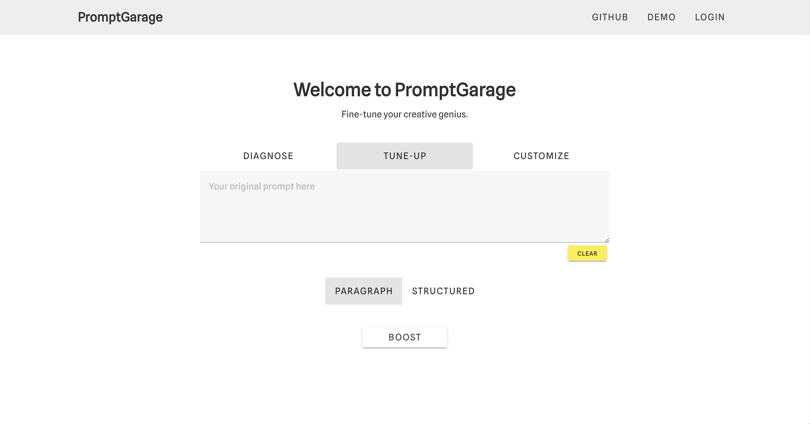
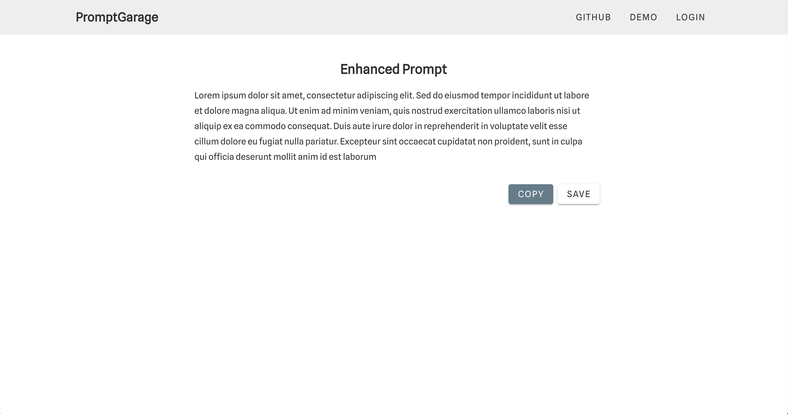
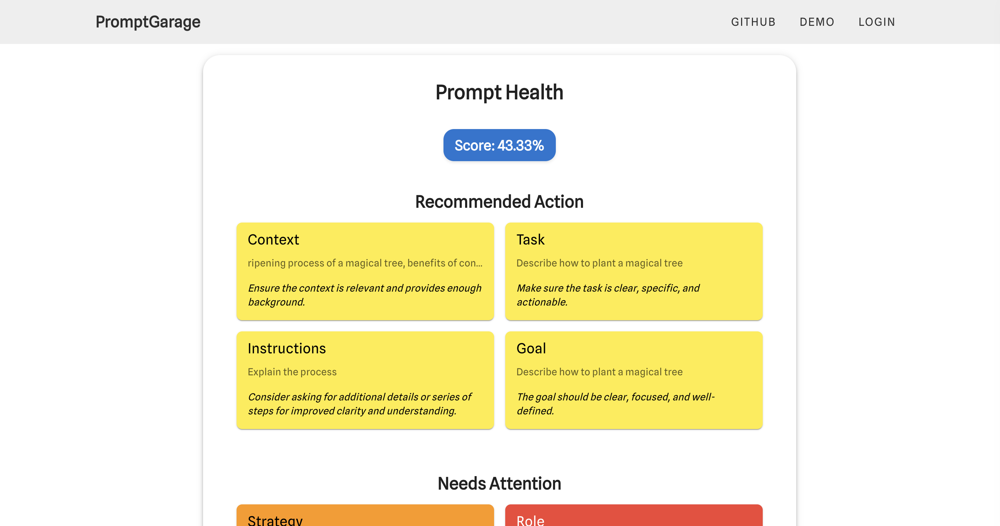
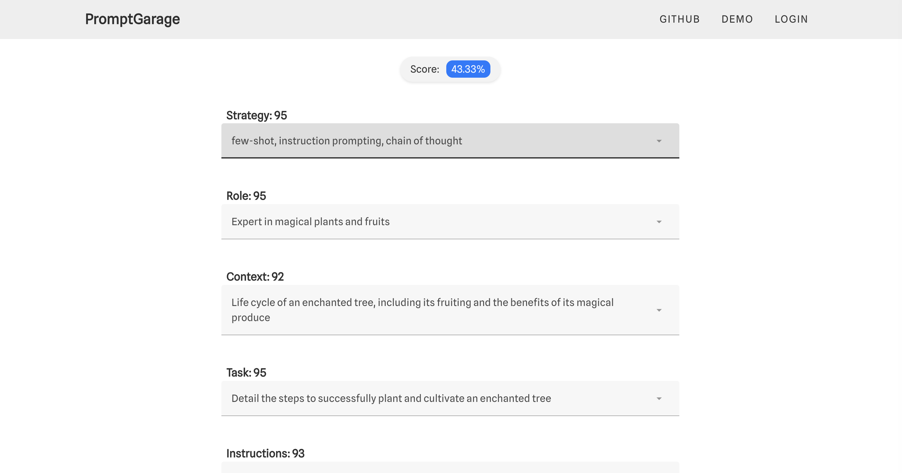
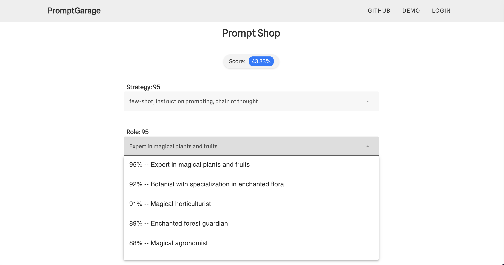
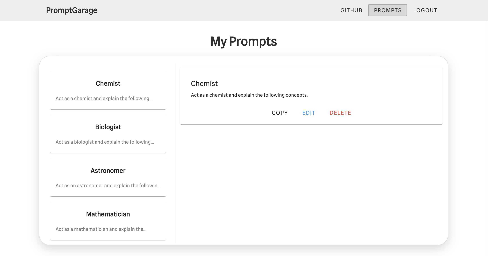

# PromptGarage

## What Is It?
PromptGarage is a unique tool designed for users who frequently engage with ChatGPT. This application provides a simple platform to enhance, diagnose, and customize prompts for a more efficient and effective AI interaction experience. Users can 'Tune-Up' prompts for improved clarity, precision and intent; 'Diagnose' them to understand the underlying structure and effectiveness; or 'Customize' them with alternative suggestions. Additionally, PromptGarage offers a personal storage space for saving and managing prompts, creating a seamless workflow for frequent AI interactions.

## Why Build It?
PromptGarage was created to address the challenges users face when crafting prompts for AI models. In the era of AI-powered solutions, the effectiveness of an interaction often hinges on the quality of the prompt, and even leveraging some prompt engineering strategies. Well, PromptGarage seeks to streamline this aspect, ensuring any user can maximize the potential of their AI interactions. It also provides a structured and organized way to manage prompts, which is often a scattered and inefficient process.

## Table of Contents
1. [Features](#features)
2. [Technologies Used](#technologies-used)
3. [Getting Started](#getting-started)
4. [Usage](#usage)
5. [Screenshots](#screenshots)
6. [Challenges and Learnings](#challenges-and-learnings)
7. [Future Enhancements](#future-enhancements)
8. [Contact](#contact)

## Features
- 'Tune-Up' feature to enhance the quality of prompts
- 'Diagnose' tool to analyze and score the components of a prompt
- 'Customize' option offering alternative suggestions for building prompts
- Personal storage for saving and organizing prompts

## Technologies Used
PromptGarage leverages a modern tech stack including: **Vue.js**, **Vuetify**, and **Vuex**.

Additional tools and libraries: **marked** for markdown rendering, **tailwindcss** for style management, and **postcss** for advanced styling features.

## Getting Started
To use PromptGarage:

```bash
# Clone the repository
git clone https://github.com/[username]/promptgarage.git
cd promptgarage

# Install dependencies
npm install

# Start the application
npm run dev
```

## Usage
### Tune-Up
The 'Tune-Up' feature allows users to refine their prompts for better clarity and specificity. By analyzing the structure and wording, it suggests modifications to enhance the prompt's effectiveness, ensuring more accurate and relevant responses from AI models. This feature is particularly useful for users seeking to optimize their interactions with AI, be it for research, creative writing, or technical queries.

### Diagnose
The 'Diagnose' tool offers a detailed breakdown of a prompt, assessing each component's effectiveness and relevance. It assigns a value score to individual elements, helping users understand the strengths and weaknesses of their prompt. This insight is invaluable for users looking to master the art of prompt crafting, enabling them to learn and improve with each interaction.

### Customize
'Customize' provides users with alternative suggestions to improve specific parts of their prompts. It offers up to five different examples for each component, fostering creativity and expanding the user's approach to prompt writing. This feature is designed to inspire users to explore various angles and styles, enhancing the diversity and richness of their interactions with AI models.

## Screenshots
## Screenshots







## Challenges and Learnings
The main challenge in developing PromptGarage was first understanding the deciding factors that make most prompts effective. This required extensive research into prompt engineering strategies and the underlying structure of AI models. It also meant creating an intuitive and effective scoring system for the 'Diagnose' feature, which required a strong understanding of how AI models interpret prompts, which as come through experience. Another challenge was designing the interface to be extremely user-friendly interface so as to maximize the potential user base without getting lost in any technical preparation beforehand.

On the software engineering side of things, this was an experience for me to practice leveraging Vuetify, Vue Router and Vuex with Vue.js, mostly for state management and real-time updates, which were a significant part of the development process.

## Future Enhancements
- Implementing machine learning algorithms for more advanced prompt analysis.
- Introducing collaborative features for shared prompt management.
- Developing a mobile app version for on-the-go prompt management.
- Expanding the customization options with more varied suggestions.
- Enhancing user interface for a more engaging experience.

## Contact
For more information, suggestions, or collaborations:

- [Portfolio](https://www.dioveloper.com/)
- [LinkedIn](https://www.linkedin.com/in/dionis-gonzalez/)
- [Email](dionisggr@gmail.com)
